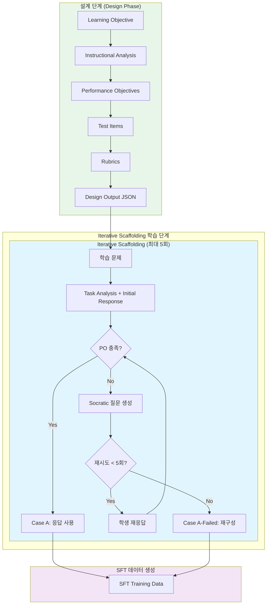
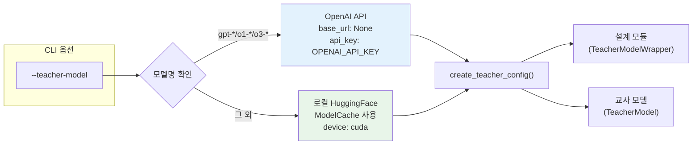

# ID-MAS 시스템 아키텍처

## 개요

ID-MAS는 Dick & Carey 교수 설계 모델을 기반으로 LLM을 학습시키는 Multi-Agent 시스템입니다. **데이터셋별 분리 학습**을 지원하며, 각 데이터셋(GSM8K, MATH)은 고유한 Terminal Goal을 가집니다. **LangGraph 기반 Iterative Scaffolding Pipeline** 방식으로 Performance Objectives 기반 평가와 Socratic 질문을 통한 반복 학습(최대 5회)으로 SFT 학습 데이터를 생성합니다. **유연한 도메인 구조**를 통해 설정 파일만 수정하여 새로운 도메인을 쉽게 추가할 수 있습니다.

## 시스템 구성

### 1. 데이터 레이어

#### 1.1 Terminal Goal 정의

각 학습 데이터셋은 고유한 Terminal Goal을 가지며, 이를 기반으로 분리 학습됩니다.

| 도메인 | 데이터셋 | Terminal Goal |
|--------|----------|---------------|
| **Math** | GSM8K | Generate coherent, step-by-step mathematical reasoning in natural language that leads to a correct numerical answer for grade-school level math problems. |
| **Math** | MATH | Solve advanced mathematical problems by selecting appropriate mathematical concepts and constructing logically valid, multi-step reasoning that leads to a correct solution. |

#### 1.2 도메인 및 데이터셋 구성

| 도메인 | 학습 데이터셋 | 평가 데이터셋 |
|--------|--------------|---------------|
| **Math** | GSM8K, MATH | GSM8K, MATH, SVAMP, ASDiv, MAWPS, MMLU |

#### 1.3 도메인 로더 (utils/domain_loader.py)

도메인별 데이터 로딩을 담당하는 핵심 클래스입니다. **데이터셋별 분리 학습**을 지원합니다.

```python
from utils.domain_loader import DomainLoader

# Math 도메인 로더 생성
loader = DomainLoader("math")

# 특정 데이터셋의 학습 데이터 로드 (분리 학습)
train_data = loader.load_training_data(dataset="gsm8k", limit=100, shuffle=True)

# 데이터셋별 Terminal Goal 조회
terminal_goal = loader.get_learning_objective("gsm8k")

# 평가 데이터 로드 (특정 데이터셋)
eval_data = loader.load_eval_data(dataset="svamp", limit=50)
```

**분리 학습 방식**: 각 데이터셋(GSM8K, MATH)별로 고유한 Terminal Goal에 맞춰 독립적으로 학습

#### 1.4 데이터셋 레지스트리 (utils/dataset_registry.py)

도메인 로더와 답변 추출기를 관리합니다.

```python
from utils.dataset_registry import DatasetRegistry

# 도메인 로더 가져오기
loader = DatasetRegistry.get_domain_loader("math")

# 도메인별 평가 데이터셋 목록
eval_datasets = DatasetRegistry.get_eval_datasets_for_domain("math")
# → ["gsm8k", "math", "svamp", "asdiv", "mawps", "mmlu"]

# 도메인별 답변 추출기
extractor = DatasetRegistry.get_extractor_for_domain("math")
# → NumericExtractor
```

#### 1.5 베이스 로더 (utils/base_loader.py)

모든 데이터셋 로더의 추상 베이스 클래스:

```python
class AnswerType(Enum):
    MCQ = "mcq"           # A/B/C/D
    NUMERIC = "numeric"   # 숫자 (정수/소수)
    LATEX = "latex"       # LaTeX 수식 (\boxed{...})
    TEXT = "text"         # 자유 텍스트
    BOOLEAN = "boolean"   # Yes/No, True/False

@dataclass
class QuestionData:
    dataset: str
    question_id: str
    question: str
    answer_type: AnswerType
    ground_truth: Any
    ground_truth_formatted: str
    choices: Optional[List[str]] = None
    metadata: Optional[Dict] = None

class BaseDatasetLoader(ABC):
    @abstractmethod
    def load_data(split, subset, limit) -> List[QuestionData]
    @abstractmethod
    def format_question_as_prompt(question) -> str
    @abstractmethod
    def format_ground_truth(question) -> str
```

#### 1.6 답변 추출기 (utils/answer_extractor.py)

답변 유형별 추출 및 비교 전략:

| 추출기 | 패턴 | 비교 방식 |
|--------|------|----------|
| `MCQExtractor` | `Answer: A`, `The answer is B` | 대소문자 무시 일치 |
| `NumericExtractor` | `#### 25`, `answer is 3.14` | `float(a) == float(b)` (오차 허용) |
| `LaTeXExtractor` | `\boxed{...}` | 정규화 후 비교 |
| `BooleanExtractor` | `Yes/No`, `True/False` | 변형 통합 |
| `TextExtractor` | 마지막 줄 추출 | 소문자 정확 일치 |

### 2. 교수 설계 모듈 (Design Modules)

모든 설계 단계 모듈은 `TeacherModelWrapper(teacher_config)`를 사용합니다. `--teacher-model`로 선택한 설정이 공유되며 기본값은 OpenAI `gpt-5-2025-08-07`입니다. 모델 설정은 [config/models.py](config/models.py)의 `create_teacher_config()`를 통해 생성됩니다.

- **API 모델 (gpt-*, o1-*, o3-*)**: OpenAI API 직접 호출
- **로컬 모델**: HuggingFace 모델을 `ModelCache`를 통해 로드 및 추론

#### 2.1 교수 분석 (analysis.py)
- **목적**: 학습 목표를 Terminal Goal, Subskills, Subtasks로 분해
- **모델**: `teacher_config` (기본 gpt-5-2025-08-07, 로컬 HuggingFace 가능)
- **출력**: 계층적 기능 분석 트리 + Anderson's Taxonomy 분류

#### 2.2 수행목표 진술 (objectives.py)
- **목적**: 각 기능에 대한 측정 가능한 수행목표 작성
- **구성**: Behavior-Condition-Criterion (B-C-CR)
- **참조**: Anderson & Krathwohl's Taxonomy (인지과정 차원 + 지식 차원)
- **모델**: `teacher_config` (기본 gpt-5-2025-08-07, 로컬 HuggingFace 가능)

#### 2.3 Test Item 개발 (test.py)
- **목적**: 수행목표 달성 여부를 평가하는 문항 생성
- **타입**: MCQ, TF, ShortAnswer, OneSentence, Essay
- **모델**: `teacher_config` (기본 gpt-5-2025-08-07, 로컬 HuggingFace 가능)

#### 2.4 루브릭 개발 (rubric.py)
- **목적**: Essay형 평가를 위한 분석적 루브릭 생성
- **템플릿**: 6가지 출력 유형별 criterion 템플릿
- **레벨**: 4단계 (명시적 수행 → 부분 수행 → 최소 수행 → 미수행)

### 3. 학습 파이프라인 모듈 (Learning Pipeline)

#### 3.1 학생 모델 (student_model.py)
- **역할**: 문제에 대한 응답 생성
- **모델**: Qwen/Llama 계열 (CLI에서 선택 가능)
  - Qwen/Qwen3-4B-Instruct-2507
  - Qwen/Qwen2.5-3B-Instruct (기본값)
  - Qwen/Qwen2.5-7B-Instruct
  - meta-llama/Llama-3.1-8B-Instruct
  - meta-llama/Llama-3.2-3B-Instruct
- **기반 클래스**: [models/base_wrapper.py](models/base_wrapper.py)의 `BaseModelWrapper` 상속
- **기능**:
  - `generate_initial_response()`: 기본 응답 생성
  - `generate_initial_response_with_scaffolding()`: Task Analysis와 함께 응답 생성
  - `respond_to_socratic_questions()`: Socratic 질문에 대한 응답 생성

#### 3.2 교사 모델 (teacher_model.py)
- **역할**: 학생 응답 평가 및 피드백 생성
- **모델**: `create_teacher_config()`로 생성 (기본 GPT-5, CLI `--teacher-model`로 변경)
  - `gpt-`, `o1-`, `o3-` prefix → OpenAI API (OPENAI_API_KEY 사용)
  - 그 외 모델 → 로컬 HuggingFace 직접 로드 (`ModelCache` 사용)
  - 설계 모듈과 동일한 `teacher_config`를 공유
  - Teacher/Student 동일 모델 사용 시 메모리 공유
- **기능**:
  - `evaluate_with_performance_objectives()`: 수행목표 기준 평가 및 Socratic 질문 생성
  - `generate_initial_hint()`: 초기 힌트 생성
  - `generate_progressive_hint()`: 점진적 힌트 생성
  - `summarize_conversation_with_ai()`: AI 기반 대화 히스토리 축약 (실패 후 재구성 시 사용)
  - `summarize_and_reconstruct()`: 5회 실패 후 요약 및 정답 재구성

#### 3.3 LangGraph 파이프라인 (learning_loop/graph/)

LangGraph 기반의 Iterative Scaffolding Pipeline 구현입니다.

**구조**:
```
learning_loop/graph/
├── __init__.py          # 모듈 export
├── state.py             # IDMASState (TypedDict 기반 상태 스키마)
├── nodes.py             # 노드 함수 정의
└── graph.py             # StateGraph 구성 및 IDMASGraphRunner
```

**상태 스키마 (state.py)**:
- `IDMASState`: TypedDict 기반 파이프라인 상태
- `QuestionResult`: 각 문제의 처리 결과
- `SFTCase`: SFT 데이터 분류 (A, A-Failed)

**노드 함수 (nodes.py)**:
- `process_question_scaffolding()`: Iterative Scaffolding 처리
- `advance_to_next_question()`: 다음 문제로 이동
- `generate_sft_data()`: SFT 데이터 생성

**그래프 흐름 (graph.py)**:
```
START → scaffolding → advance → [조건부 라우팅]
                                  ├─ (더 많은 문제) → scaffolding
                                  └─ (완료) → finalize → END
```

**사용 예시**:
```python
from learning_loop.graph import IDMASGraphRunner

# Runner 생성
runner = IDMASGraphRunner(
    student_model=student,
    teacher_model=teacher,
    answer_extractor=extractor,
)

# 파이프라인 실행
result = runner.run(
    domain="math",
    train_dataset="gsm8k",
    terminal_goal=terminal_goal,
    student_model_name="Qwen/Qwen2.5-3B-Instruct",
    teacher_model_name="gpt-5",
    model_short="Qwen2.5-3B-Instruct",
    questions=questions,
    design_result=design_result,
    output_dir=output_dir,
)
```

**핵심 기능**:
- **StateGraph 기반**: LangGraph의 상태 그래프로 워크플로우 관리
- **조건부 라우팅**: 문제 처리 완료 여부에 따른 자동 전환
- **체크포인트**: MemorySaver 기반 상태 저장
- **Iterative Scaffolding**: 최대 5회 반복 학습으로 정답 도출

#### 3.4 Models 패키지 구조

모델 래퍼 클래스들의 계층 구조입니다.

**BaseModelWrapper (base_wrapper.py)**
- 모든 래퍼의 추상 베이스 클래스
- `generate()`, `generate_json()` 인터페이스 정의

**TeacherModelWrapper (teacher_wrapper.py)**
- API 모델 (gpt-*, o1-*, o3-*): OpenAI API 호출
- 로컬 모델: `ModelCache`를 통해 로드 및 추론
- `LocalModelMixin` 상속으로 로컬 생성 로직 공유

**StudentModelWrapper (student_wrapper.py)**
- 로컬 HuggingFace 모델 전용
- `ModelCache`를 통해 모델 로드
- SFT/SFT_ID-MAS 모델 지원

**ModelCache (model_cache.py)**
- 글로벌 싱글톤 캐시
- Teacher/Student 동일 모델 사용 시 메모리 공유
- 메서드: `get_or_load()`, `is_loaded()`, `clear()`, `memory_usage()`

**LocalModelMixin (local_model_mixin.py)**
- 로컬 HuggingFace 모델 생성 로직 공유
- `TeacherModelWrapper`와 `StudentModelWrapper`에서 사용
- `_generate_with_local_model()` 메서드 제공

## Iterative Scaffolding Pipeline 프레임워크

### 전체 파이프라인 흐름 (Mermaid)



### 모델 선택 흐름 (Mermaid)



### Iterative Scaffolding 프로세스

모든 학습 문제에 대해 Task Analysis와 함께 응답을 생성하고, Performance Objectives 기반 평가를 통해 반복 학습합니다.

```
학습 문제 입력
    ↓
[Task Analysis 생성] ← 문제 분석 및 접근 전략
    ↓
[Initial Response 생성] ← Terminal Goal 강조
    ↓
[Teacher 평가] → 수행목표(PO) 충족 여부 판정
    ↓
[PO 충족?]
    ├─ Yes → Case A (성공)
    └─ No → [Socratic 질문 생성]
              ↓
         [학생 재응답] ← 교사 피드백 반영
              ↓
         [반복 (최대 5회)]
              ↓
         [5회 실패 시 A-Failed 재구성]
              ├─ AI 기반 대화 히스토리 축약 (summarize_conversation_with_ai)
              └─ 정답 솔루션 재구성 (summarize_and_reconstruct)
```

**성공 조건**: 모든 수행목표(PO)가 충족되면(`all_satisfied=True`) 성공(Case A)으로 처리됩니다. 정답 여부(`is_correct`)는 SFT 케이스 분류에 영향을 주지 않습니다.

**Iterative Scaffolding 흐름**: PO가 충족되지 않은 경우, 교사 모델이 Socratic 질문을 생성하여 학생의 사고를 유도합니다. 최대 5회까지 재시도하며, 5회 시도 후에도 PO 충족 조건을 만족하지 못하면 A-Failed 케이스로 분류됩니다. AI가 대화 히스토리를 분석하여 학생의 약점을 파악한 후 정답 솔루션을 재구성합니다.

### SFT 데이터 생성

Iterative Scaffolding 결과를 SFT 학습 데이터로 변환합니다.

| 조건 | SFT Case | SFT 데이터 응답 |
|------|----------|-----------------|
| PO 충족 | Case A | 학생 응답 사용 (1회 또는 다중 시도) |
| max_iterations 후 PO 미충족 | Case A-Failed | Reconstruction 응답 사용 |

## 데이터 흐름

### 설계 단계
```
Learning Objective
    ↓
[Instructional Analysis] → Terminal Goal + Subskills
    ↓
[Performance Objectives] → B-C-CR 형식 목표
    ↓
[Test Item Development] → 평가 문항
    ↓
[Rubric Development] → 루브릭 (Essay형만)
    ↓
Design Output (JSON)
```

### 학습 단계 (Iterative Scaffolding Pipeline)
```
Dataset-specific Training Data (GSM8K 또는 MATH)
    ↓
[DomainLoader.load_training_data(dataset)] → QuestionData 객체
    ↓
[Terminal Goal 조회] → 데이터셋별 고유 학습 목표
    ↓
[Iterative Scaffolding] (문제별)
  - Task Analysis + Initial Response
  - Teacher 평가 (PO 기반)
  - Socratic 질문 → 학생 재응답 (최대 5회)
  - 성공: Case A / 실패: Case A-Failed (재구성)
    ↓
[SFT 데이터 생성]
    ↓
learning_logs/{identifier}_sft_data.json
```

### 평가 단계
```
Test Question (도메인 내 평가 데이터셋)
    ↓
[Model Selection]
  - Baseline: 베이스 모델
  - SFT: HuggingFace SFT 모델
  - SFT_ID-MAS: ID-MAS SFT 모델
    ↓
[Student Response 생성]
    ↓
[AnswerExtractor] → 답변 추출
    ↓
[정답 비교] → 정오 판정
    ↓
eval_results/{dataset}_eval_results-{method}.json
```

## 디렉토리 구조

### 도메인 기반 데이터 구조 (새 구조)

```
data/
└── math/                                # Math 도메인
    ├── train/                           # 학습 데이터
    │   ├── data/                        # 원본 학습 데이터
    │   │   ├── gsm8k_train.json
    │   │   └── math_train.json
    │   │
    │   └── {Teacher-Model}/             # Teacher 모델별 (예: gpt-5-2025-08-07)
    │       ├── instructional-design/    # 설계 결과
    │       │   ├── math_gsm8k_design.json
    │       │   └── math_math_design.json
    │       │
    │       └── {Student-Model}/         # Student 모델별 출력
    │           ├── gsm8k_train_id-mas_{Model}.json      # SFT 데이터
    │           ├── gsm8k_train_id-mas_{Model}_logs.json # Pipeline 로그
    │           └── gsm8k_checkpoint_{timestamp}.json    # 체크포인트
    │
    └── eval/                            # 평가 데이터
        ├── data/                        # 원본 평가 데이터
        │   ├── gsm8k_test.json
        │   ├── math_test.json
        │   ├── svamp_test.json
        │   ├── asdiv_test.json
        │   ├── mawps_test.json
        │   └── mmlu_test.json
        │
        └── {Model}/                     # 모델별 평가 결과
            ├── gsm8k_eval_results-Baseline.json
            ├── gsm8k_eval_results-SFT.json
            └── gsm8k_eval_results-SFT_ID-MAS.json
```

### JSON 데이터 형식

```json
{
  "instruction": "You are a helpful math assistant...",
  "input": "문제 텍스트",
  "output": "풀이 과정... #### [정답]"
}
```

정답 추출: `#### [answer]` 패턴에서 추출

## 평가 방법

### Baseline
- 베이스 모델로 직접 평가
- 순수 모델 성능 측정

### SFT (Supervised Fine-Tuning)
- HuggingFace Hub에서 SFT 모델 로드
- `SaFD-00/{model}-{domain}` 형식

### SFT_ID-MAS
- ID-MAS Iterative Scaffolding Pipeline으로 생성된 SFT 데이터로 학습된 모델
- `SaFD-00/{model}-{domain}_id-mas` 형식

## 학습/평가 분리 아키텍처

### 실행 모드 구조

ID-MAS는 학습(train)과 평가(eval)를 완전히 분리하여 독립적으로 실행할 수 있습니다.

```
┌─────────────────────────────────────────────────────────────────┐
│                      ID-MAS 실행 모드                            │
├─────────────────────────────────────────────────────────────────┤
│                                                                 │
│  [--mode train]                    [--mode eval]                │
│       │                                 │                       │
│       ▼                                 ▼                       │
│  ┌─────────────┐                 ┌─────────────┐               │
│  │ IDMASPipeline│                 │IDMASEvaluator│               │
│  │  (학습 전용) │                 │  (평가 전용) │               │
│  └─────────────┘                 └─────────────┘               │
│       │                                 │                       │
│       ▼                                 ▼                       │
│  Design → Iterative              ┌──────┼──────┐               │
│       │   Scaffolding           │       │      │               │
│       ▼                  [baseline] [sft] [sft_id-mas]         │
│  SFT 데이터 생성                 │       │      │               │
│                                  ▼       ▼      ▼               │
│                              베이스   SFT    ID-MAS             │
│                              모델    모델    SFT 모델           │
│                                                                 │
└─────────────────────────────────────────────────────────────────┘
```

### 학습 모드 흐름 (--mode train)

```
python main.py --mode train --domain math --train-dataset gsm8k

                    ┌─────────────────────────────────┐
                    │        IDMASPipeline            │
                    │       (학습 전용 클래스)          │
                    └─────────────────────────────────┘
                                    │
                                    ▼
┌─────────────────────────────────────────────────────────────────┐
│ Step 1: 설계 단계 (Design Phase)                                 │
│   - Terminal Goal 로드 (gsm8k → GSM8K-specific goal)            │
│   - Instructional Analysis (GPT-5)                              │
│   - Performance Objectives (B-C-CR)                             │
│   - Test Items & Rubrics                                        │
│                                                                 │
│   출력: data/math/design_outputs/math_gsm8k_design.json         │
└─────────────────────────────────────────────────────────────────┘
                                    │
                                    ▼
┌─────────────────────────────────────────────────────────────────┐
│ Step 2: Iterative Scaffolding 학습 단계 (Learning Phase)         │
│   - DomainLoader.load_training_data("gsm8k")                    │
│   - Iterative Scaffolding (최대 5회 반복)                        │
│   - Teacher 평가 (PO 기반) + Socratic 질문                       │
│   - Case A (성공) / Case A-Failed (재구성)                       │
│                                                                 │
│   출력: data/math/Qwen2.5-3B-Instruct/gsm8k/learning_logs/      │
└─────────────────────────────────────────────────────────────────┘
                                    │
                                    ▼
┌─────────────────────────────────────────────────────────────────┐
│ Step 3: SFT 데이터 저장                                          │
│   - SFT 데이터 파일 경로:                                        │
│     data/math/Qwen2.5-3B-Instruct/gsm8k/learning_logs/          │
│     └── math_gsm8k_sft_data.json                                │
│                                                                 │
│   ※ 평가 관련 작업 없음 (eval 옵션 사용 불가)                     │
└─────────────────────────────────────────────────────────────────┘
```

### 평가 모드 흐름 (--mode eval)

#### Baseline 평가 (--method baseline)

```
python main.py --mode eval --method baseline \
    --domain math --eval-dataset gsm8k

                    ┌─────────────────────────────────┐
                    │        IDMASEvaluator           │
                    │       (평가 전용 클래스)          │
                    └─────────────────────────────────┘
                                    │
                                    ▼
┌─────────────────────────────────────────────────────────────────┐
│ Step 1: 도메인 검증                                              │
│   --domain: math                                                 │
│   --eval-dataset: gsm8k                                          │
│                                                                 │
│   → gsm8k가 math 도메인의 평가 데이터셋인지 확인                  │
└─────────────────────────────────────────────────────────────────┘
                                    │
                                    ▼
┌─────────────────────────────────────────────────────────────────┐
│ Step 2: 평가 데이터 로드                                         │
│   - DomainLoader("math").load_eval_data("gsm8k")                │
└─────────────────────────────────────────────────────────────────┘
                                    │
                                    ▼
┌─────────────────────────────────────────────────────────────────┐
│ Step 3: 베이스 모델 평가                                         │
│   For each question:                                            │
│     1. 프롬프트 생성                                             │
│     2. 베이스 모델 응답 생성                                     │
│     3. 정답 비교 (AnswerExtractor)                               │
│                                                                 │
│   출력: data/math/Qwen2.5-3B-Instruct/gsm8k/eval_results/       │
│         gsm8k_eval_results-Baseline.json                        │
└─────────────────────────────────────────────────────────────────┘
```

#### SFT 평가 (--method sft)

```
python main.py --mode eval --method sft \
    --domain math --eval-dataset gsm8k

┌─────────────────────────────────────────────────────────────────┐
│ SFT 모델 로드                                                    │
│   - HuggingFace Hub: SaFD-00/{model}-{domain}                   │
│   - 예: SaFD-00/qwen2.5-3b-math                                 │
│                                                                 │
│   출력: gsm8k_eval_results-SFT.json                             │
└─────────────────────────────────────────────────────────────────┘
```

#### SFT_ID-MAS 평가 (--method sft_id-mas)

```
python main.py --mode eval --method sft_id-mas \
    --domain math --eval-dataset gsm8k

┌─────────────────────────────────────────────────────────────────┐
│ SFT_ID-MAS 모델 로드                                             │
│   - HuggingFace Hub: SaFD-00/{model}-{domain}_id-mas            │
│   - 예: SaFD-00/qwen2.5-3b-math_id-mas                          │
│                                                                 │
│   출력: gsm8k_eval_results-SFT_ID-MAS.json                      │
└─────────────────────────────────────────────────────────────────┘
```

### CLI 옵션 검증 규칙

```
┌────────────────────────────────────────────────────────────────────┐
│                    --mode train 검증 규칙                          │
├────────────────────────────────────────────────────────────────────┤
│ 필수: --domain, --train-dataset                                    │
│ 선택: --model, --teacher-model, --run-design, --resume             │
│ 기본: --resume True (이어서 학습), 기존 설계 로드                     │
│                                                                    │
│ 금지: --eval-dataset, --method                                     │
└────────────────────────────────────────────────────────────────────┘

┌────────────────────────────────────────────────────────────────────┐
│                    --mode eval 검증 규칙                           │
├────────────────────────────────────────────────────────────────────┤
│ 필수: --method (baseline|sft|sft_id-mas), --domain, --eval-dataset │
│ 선택: --model, --eval-resume                                       │
│ 기본: --eval-resume True (이어서 평가)                              │
│                                                                    │
│ 금지: --train-dataset, --run-design                                │
│                                                                    │
│ 검증: eval-dataset이 domain에 속하는지 확인                         │
│       sft/sft_id-mas 시 모델 지원 여부 확인                         │
└────────────────────────────────────────────────────────────────────┘
```

`--teacher-model`은 학습 모드에서 교사/설계 모델을 선택하며, 지정하지 않으면 OpenAI `gpt-5-2025-08-07`을 사용합니다.

## CLI 사용법

### 학습 모드

```bash
# Math 도메인 - GSM8K로 학습
python main.py --mode train --domain math --train-dataset gsm8k

# 처음부터 새로 학습 (Resume 비활성화)
python main.py --mode train --domain math --train-dataset gsm8k --resume False

# vLLM 교사 모델 사용 (권장: Qwen3-30B-A3B-Instruct-2507-FP8)
python main.py --mode train --domain math --train-dataset gsm8k \
    --teacher-model Qwen/Qwen3-30B-A3B-Instruct-2507-FP8

# Math 도메인 - MATH로 학습
python main.py --mode train --domain math --train-dataset math
```

### 평가 모드 (Baseline)

```bash
# GSM8K Baseline 평가
python main.py --mode eval --method baseline \
    --domain math --eval-dataset gsm8k

# SVAMP Cross-dataset 평가
python main.py --mode eval --method baseline \
    --domain math --eval-dataset svamp
```

### 평가 모드 (SFT)

```bash
# GSM8K SFT 평가
python main.py --mode eval --method sft \
    --domain math --eval-dataset gsm8k

# MATH SFT 평가
python main.py --mode eval --method sft \
    --domain math --eval-dataset math
```

### 평가 모드 (SFT_ID-MAS)

```bash
# GSM8K SFT_ID-MAS 평가
python main.py --mode eval --method sft_id-mas \
    --domain math --eval-dataset gsm8k

# MATH SFT_ID-MAS 평가
python main.py --mode eval --method sft_id-mas \
    --domain math --eval-dataset math

# 처음부터 새로 평가 (Resume 비활성화)
python main.py --mode eval --method sft_id-mas \
    --domain math --eval-dataset gsm8k --eval-resume False
```

## 설정 파라미터

### 모델 설정
```python
# 교사 모델 (OpenAI API 또는 로컬 HuggingFace)
AVAILABLE_TEACHER_MODELS = [
    "gpt-5-2025-08-07",                 # 기본 (OpenAI API)
    "Qwen/Qwen2.5-3B-Instruct",         # 로컬 HuggingFace
    "Qwen/Qwen2.5-7B-Instruct",
    "Qwen/Qwen2.5-14B-Instruct",
    "Qwen/Qwen3-4B-Instruct-2507",
    "meta-llama/Llama-3.1-8B-Instruct",
    "meta-llama/Llama-3.2-3B-Instruct",
]

DEFAULT_TEACHER_MODEL = "gpt-5-2025-08-07"

def create_teacher_config(model_name: str = None) -> dict:
    if model_name is None:
        model_name = DEFAULT_TEACHER_MODEL

    # API 모델 판단 (OpenAI 모델)
    is_openai_model = (
        model_name.startswith("gpt-") or
        model_name.startswith("o1") or
        model_name.startswith("o3")
    )

    # OpenAI 모델
    if is_openai_model:
        return {
            "model": model_name,
            "base_url": None,  # OpenAI 기본 endpoint
            "api_key": OPENAI_API_KEY,
            "reasoning": {"effort": "medium"},
            "text": {"verbosity": "medium"},
            "max_tokens": 8192
        }

    # 로컬 HuggingFace 모델
    return {
        "model": model_name,
        "device": "cuda",
        "max_new_tokens": 8192,
        "temperature": 0.7,
        "do_sample": True
    }

# 기본 교사 설정 (설계 모듈 + TeacherModel 공용)
DESIGN_MODEL_CONFIG = create_teacher_config(DEFAULT_TEACHER_MODEL)

# 학생 모델 (CLI에서 선택 가능)
AVAILABLE_STUDENT_MODELS = [
    "Qwen/Qwen3-4B-Instruct-2507",
    "Qwen/Qwen2.5-3B-Instruct",      # 기본값
    "Qwen/Qwen2.5-7B-Instruct",
    "meta-llama/Llama-3.1-8B-Instruct",
    "meta-llama/Llama-3.2-3B-Instruct",
]
```
`main.py`에서 `--teacher-model` CLI 인자로 `create_teacher_config()`를 호출해 교사/설계 모델 설정을 생성합니다. `gpt-`, `o1-`, `o3-` 계열은 OpenAI API를, 그 외 모델은 로컬 HuggingFace 직접 로드를 사용합니다.

**Teacher Model Default**: `gpt-5-2025-08-07` (OpenAI API)

**로컬 모델 사용**: `--teacher-model` 옵션으로 `AVAILABLE_TEACHER_MODELS` 중 로컬 모델을 지정하면 `ModelCache`를 통해 HuggingFace 모델을 직접 로드합니다. Teacher/Student 동일 모델 사용 시 메모리가 공유됩니다.

## 새로운 도메인 추가 가이드

ID-MAS는 **설정 기반의 유연한 도메인 구조**를 제공합니다. 새로운 도메인을 추가할 때는 코드 수정 없이 설정 파일만 업데이트하면 됩니다.

### Step 1: 데이터 준비

새 도메인의 디렉토리 구조와 데이터 파일을 생성합니다:

```bash
# 디렉토리 구조 생성
mkdir -p data/{your_domain}/train/data
mkdir -p data/{your_domain}/eval/data

# 학습 데이터 배치
# data/{your_domain}/train/data/{dataset}_train.json

# 평가 데이터 배치
# data/{your_domain}/eval/data/{eval_dataset}_test.json
```

**데이터 형식 예시** (기존 math 도메인의 JSON 구조 참고):

```json
{
  "instruction": "You are a helpful assistant...",
  "input": "문제 텍스트",
  "output": "풀이 과정... #### [정답]"
}
```

### Step 2: config 모듈 업데이트

**참고**: config 모듈은 리팩토링되어 여러 서브모듈로 분리되었습니다 ([config/domains.py](config/domains.py), [config/models.py](config/models.py) 등). backward compatibility를 위해 `from config import ...` 형태의 기존 import는 그대로 작동합니다.

[config/domains.py](config/domains.py)의 **4개의 딕셔너리**에 새 도메인 정보를 추가합니다:

#### 2.1 TERMINAL_GOALS 추가

학습 데이터셋별 Terminal Goal을 명확하게 정의합니다:

```python
TERMINAL_GOALS = {
    # 기존 도메인
    "gsm8k": "Generate coherent, step-by-step mathematical reasoning...",
    "math": "Solve advanced mathematical problems...",

    # 새 도메인 추가
    "your_dataset": "Your clear, specific terminal goal description here. Must be measurable and domain-specific."
}
```

#### 2.2 DATASET_TO_DOMAIN 추가

데이터셋을 도메인에 매핑합니다:

```python
DATASET_TO_DOMAIN = {
    # 기존 매핑
    "gsm8k": "math",
    "math": "math",

    # 새 도메인 추가
    "your_dataset": "your_domain"
}
```

#### 2.3 TRAINING_DATASETS 추가

도메인별 학습 데이터셋 목록을 추가합니다:

```python
TRAINING_DATASETS = {
    # 기존 도메인
    "math": ["gsm8k", "math"],

    # 새 도메인 추가
    "your_domain": ["your_dataset", "another_dataset"]
}
```

#### 2.4 DOMAIN_CONFIG 추가

도메인의 전체 설정을 추가합니다:

```python
DOMAIN_CONFIG = {
    # 기존 도메인
    "math": {
        "data_dir": DATA_DIR / "math",
        "training_datasets": ["gsm8k", "math"],
        "eval_datasets": ["gsm8k", "math", "svamp", "asdiv", "mawps", "mmlu"],
        "default_eval": "gsm8k"
    },

    # 새 도메인 추가
    "your_domain": {
        "data_dir": DATA_DIR / "your_domain",
        "training_datasets": ["your_dataset", "another_dataset"],
        "eval_datasets": ["your_eval_dataset1", "your_eval_dataset2"],
        "default_eval": "your_eval_dataset1"
    }
}
```

### Step 3: utils/domain_loader.py 업데이트

**동일한 정보**를 `utils/domain_loader.py`에도 추가합니다 (중복 정의 필요):

```python
# TERMINAL_GOALS (lines 38-44)
TERMINAL_GOALS = {
    "gsm8k": "...",
    "math": "...",
    "your_dataset": "Your terminal goal..."
}

# DOMAIN_CONFIG (lines 46-78)
DOMAIN_CONFIG = {
    "math": {...},
    "your_domain": {
        "data_dir": Path("data/your_domain"),
        "training_datasets": {
            "your_dataset": {
                "filename": "your_dataset_train.json",
                "answer_type": AnswerType.NUMERIC  # 또는 적절한 타입
            }
        },
        "eval_datasets": {
            "your_eval_dataset": {
                "filename": "your_eval_dataset_test.json",
                "answer_type": AnswerType.NUMERIC
            }
        }
    }
}
```

### Step 4: 실행 및 테스트

새 도메인으로 학습과 평가를 테스트합니다:

```bash
# 학습 테스트
python main.py --mode train --domain your_domain --train-dataset your_dataset

# 평가 테스트
python main.py --mode eval --method baseline \
    --domain your_domain --eval-dataset your_eval_dataset
```

### Step 5: 동적 검증 확인

다음 명령어로 설정이 올바르게 로드되는지 확인합니다:

```python
# Python에서 확인
from config import get_available_domains, get_training_datasets_for_domain
print(get_available_domains())  # ['math', 'your_domain']
print(get_training_datasets_for_domain('your_domain'))  # ['your_dataset', ...]
```

### 주의사항

1. **Terminal Goal 작성**:
   - 측정 가능하고 명확해야 함
   - 학습 데이터셋의 특성을 정확히 반영
   - 너무 일반적이거나 모호하지 않게 작성

2. **Answer Type 선택**:
   - `AnswerType.NUMERIC`: 숫자 답변 (정수/소수)
   - `AnswerType.MCQ`: 선택형 (A/B/C/D)
   - `AnswerType.LATEX`: LaTeX 수식
   - `AnswerType.TEXT`: 자유 텍스트
   - `AnswerType.BOOLEAN`: Yes/No, True/False

3. **데이터 구조**:
   - 반드시 `data/{domain}/train/data/`와 `data/{domain}/eval/data/` 구조 사용
   - 파일명 형식: `{dataset}_train.json`, `{dataset}_test.json`

4. **코드 수정 불필요**:
   - 모든 검증이 동적으로 처리됨 (`get_available_domains()` 등)
   - 새 도메인 추가 시 코어 로직 변경 불필요

### 확장 가능성

#### 새 평가 데이터셋 추가
1. `data/{domain}/eval/data/{dataset}_test.json` 파일 생성
2. `utils/domain_loader.py`의 해당 도메인 `eval_datasets`에 추가
3. `config.py`의 `DOMAIN_CONFIG`에 평가 데이터셋 추가

#### 새 Answer Extractor 추가
답변 형식이 기존 5가지 타입과 다를 경우:
1. `utils/answer_extractor.py`에 새 Extractor 클래스 구현
2. `AnswerType` enum에 새 타입 추가
3. `AnswerExtractorFactory`에 매핑 추가

#### SFT 모델 추가
HuggingFace Hub에 업로드 시:
1. 형식: `SaFD-00/{model_short}-{domain}` 또는 `SaFD-00/{model_short}-{domain}_id-mas`
2. [config/sft.py](config/sft.py)의 `MODEL_NAME_TO_SHORT` 매핑 업데이트

## 참고 문헌

1. Dick, W., Carey, L., & Carey, J. O. (2015). The systematic design of instruction (8th ed.). Pearson.
2. Anderson, L. W., & Krathwohl, D. R. (2001). A taxonomy for learning, teaching, and assessing. Longman.
3. Hendrycks, D., et al. (2021). Measuring Massive Multitask Language Understanding. ICLR 2021.
